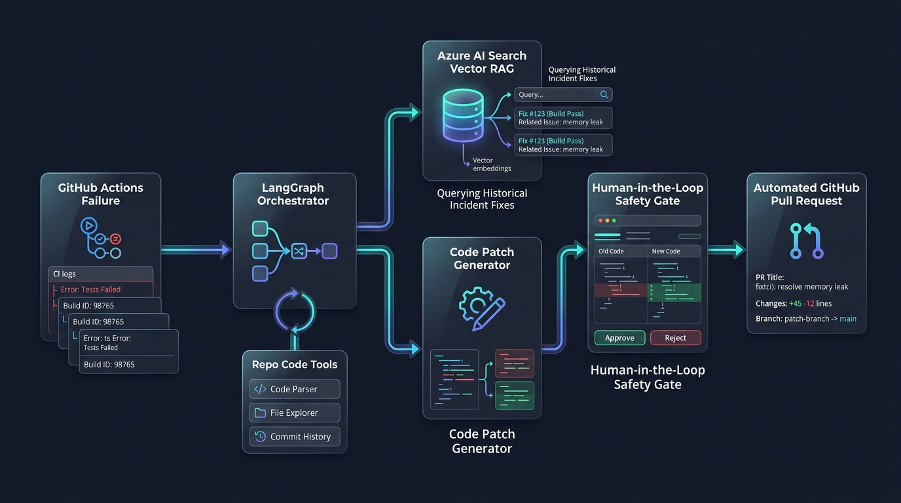

# 🛠️ Autonomous AI CI/CD Failure Investigator & Auto-Remediator

[](https://www.python.org/)
[](https://github.com/langchain-ai/langgraph)
[](https://fastapi.tiangolo.com/)
[](https://azure.microsoft.com/en-us/products/ai-services/ai-search/)
[](https://groq.com/)
[](https://github.com/PyGithub/PyGithub)

> **An enterprise-grade, stateful AI agent that diagnoses failing GitHub Actions workflows in real time, cross-references historical postmortems via Azure AI Search RAG, synthesizes surgical code patches, and opens verified Pull Requests under strict Human-in-the-Loop (HITL) safety controls.**

---

## 📌 Executive Summary & Motivation

In modern engineering organizations, broken CI/CD pipelines are one of the single largest drains on developer velocity:
- **High MTTR (Mean Time to Resolution)**: Engineers spend 20–40 minutes context-switching to pull raw CI logs, isolate stack traces, and locate the root cause in the repo.
- **Tribal Knowledge Gaps**: Solutions to recurring infrastructure failures (e.g., dependency mismatches, missing packaging descriptors, Dockerfile drift) are often buried in past Jira tickets or Slack threads rather than reused systematically.
- **Hallucination & Safety Risks**: Autonomous bots that commit fixes directly to `main` without human validation can introduce silent regressions or security vulnerabilities.

### 💡 What I Built
I engineered this **Autonomous AI CI/CD Investigator** to bridge that gap. It acts as an automated Level-2 DevOps on-call engineer:
1. **Listens & Ingests**: Fetches raw workflow logs from GitHub Actions and isolates the critical error window.
2. **Autonomous Multi-Turn Investigation**: Navigates the repository (inspects file trees, searches code symbols) to build an evidence-backed hypothesis.
3. **Enterprise Vector RAG**: Queries past incident databases in **Azure AI Search** using vector similarity (`text-embedding-ada-002`) to extract proven historical fixes.
4. **Surgical Code Synthesis**: Generates targeted, compile-ready file patches.
5. **Human-in-the-Loop (HITL) Checkpoint**: Pauses execution state via LangGraph `MemorySaver`, rendering a visual diff for human approval.
6. **One-Click PR Generation**: Automatically forks a branch, applies the patch via the GitHub REST API, and opens a Pull Request with a comprehensive Root Cause Analysis (RCA).

---

## 🎬 Live Demo

https://github.com/user-attachments/assets/a24224ce-6165-48ed-bd9c-b284289f36e4

> 💡 *Watch the end-to-end flow: from GitHub Actions failure log ingestion and autonomous repository investigation, through Azure AI Search RAG matching, to the Human-in-the-Loop review and automatic PR creation.*

---

## 🏗️ System Architecture

```mermaid
flowchart TD
    subgraph Ingestion [1. Ingestion & Log Triage]
        A([GitHub Actions Failure]) -->|Run ID & Repo| B[📡 Collect Evidence Node]
        B -->|Extract Tail Logs & Error Window| C[📝 Initial Evidence State]
    end

    subgraph LangGraphLoop [2. Multi-Turn Autonomous Investigation]
        C --> D[🧠 Investigator LLM Node]
        D <-->|Tool: Fetch File Content| E[📂 GitHub File Inspector]
        D <-->|Tool: Search Symbol / Grep| F[🔎 GitHub Symbol Search]
        D -->|Hypothesis Formulated| G[🔍 Final RCA Node]
    end

    subgraph KnowledgeRetrieval [3. Enterprise RAG]
        G -->|RCA Query Vector| H[📚 Azure AI Search]
        H -->|Historical Incident Fixes| I[📄 Formatted RAG Context]
    end

    subgraph Remediation [4. Patch Synthesis & HITL Gate]
        I --> J[🛠️ Code Fixer Agent]
        J -->|Synthesize Code Diff| K[💾 LangGraph Memory Checkpoint]
        
        K --> L{👤 Human Reviewer Dashboard}
        L -->|Reject| M([🛑 Investigation Closed])
        L -->|Approve| N[🚀 Create PR Node]
    end

    subgraph GitHubOutput [5. Pull Request Execution]
        N -->|Create Fix Branch| O[🌿 Git Branch: ai-fix/run-id]
        O -->|Commit File Blobs| P[📦 GitHub Commit]
        P --> Q([🎉 Pull Request Opened])
    end

    style LangGraphLoop fill:#0f172a,stroke:#3b82f6,stroke-width:2px;
    style KnowledgeRetrieval fill:#022c22,stroke:#10b981,stroke-width:2px;
    style Remediation fill:#1e1b4b,stroke:#6366f1,stroke-width:2px;
```





---

## 🌟 Key Engineering Innovations & Standout Features

### 1. 🧠 Stateful, Multi-Turn LangGraph Architecture
Unlike basic linear LLM chains that blindly guess fixes from log snippets alone, this system employs a cyclic state machine. The agent can dynamically inspect the repository layout, read configuration files (`requirements.txt`, `Dockerfile`, `.github/workflows`), and test hypotheses across multiple turns before arriving at a definitive root cause.

### 2. 🛡️ True Human-in-the-Loop (HITL) Checkpoint Safety
The state graph is configured with `interrupt_before=["create_pr"]` backed by an in-memory or persistent LangGraph checkpointer (`MemorySaver`).
- The agent halts execution *after* generating the patch.
- The thread ID is preserved.
- The backend resumes the exact state thread only when the human clicks **Approve** in the dashboard, guaranteeing that no code is ever committed to GitHub without human sign-off.

### 3. 🔍 Enterprise Hybrid RAG with Azure AI Search
- Historical postmortems and known incident resolutions (`data/incidents.json`) are vectorized using `AzureOpenAIEmbeddings` (`text-embedding-ada-002`) and stored in **Azure AI Search** (`ci-incidents` index).
- Features seamless fallback to `InMemoryVectorStore` when running offline or without cloud credentials.
- The retriever queries past incident patterns using cosine similarity and injects relevant prior fixes directly into the prompt context for high-accuracy remediation.

### 4. ⚡ Real-Time Streaming UI via NDJSON (Zero-WebSocket Overhead)
- The FastAPI backend streams progress updates in real time using `StreamingResponse` and NDJSON (Newline Delimited JSON).
- The vanilla JavaScript client processes chunks using the Streams API (`ReadableStream` / `getReader()`), delivering instant live feedback across a 5-step interactive timeline with zero WebSocket infrastructure complexity.

### 5. 🎨 Modern Glassmorphic Dark-Mode Dashboard
- Responsive, typography-focused UI designed from scratch with pure Vanilla CSS tokens.
- Features real-time state transitions, step-by-step collapsible log inspection, side-by-side unified diff highlighting, and one-click GitHub PR creation.

---

## 📂 Repository Structure

```
├── app/
│   ├── agent/
│   │   ├── investigator.py       # Multi-turn diagnostic agent with tool calling
│   │   └── fixer.py              # Surgical code patch synthesizer
│   ├── github/
│   │   └── client.py             # PyGithub client (logs, files, branches & PRs)
│   ├── graph/
│   │   ├── graph.py              # Compiled LangGraph state machine with HITL interrupt
│   │   ├── nodes.py              # Pure functional nodes for evidence, RCA, RAG & PR
│   │   ├── routing.py            # Dynamic tool-use routing condition
│   │   └── state.py              # Strongly typed State schema (TypedDict)
│   ├── models/
│   │   ├── evidence.py           # Pydantic schemas for CI logs & raw evidence
│   │   ├── rca.py                # Pydantic schemas for Root Cause Analysis
│   │   ├── fix.py                # Code fix and diff data models
│   │   └── requests.py           # API request/response payloads
│   ├── rag/
│   │   ├── store.py              # Document ingestion & Azure AI Search indexer
│   │   └── retriever.py          # Similarity search & context injection
│   ├── services/
│   │   └── evidence.py           # Error window log isolation service
│   ├── static/
│   │   ├── index.html            # Dark-mode dashboard structure
│   │   ├── style.css             # Glassmorphic design system
│   │   └── app.js                # NDJSON stream consumer & dynamic DOM renderer
│   └── main.py                   # FastAPI server & streaming endpoints
├── data/
│   └── incidents.json            # Seed dataset of historical CI/CD postmortems
├── .env.example                  # Environment configuration template
├── requirements.txt              # Production dependencies
└── README.md                     # Documentation
```

---

## ⚙️ Technical Deep Dives & Architectural Decisions

### Why LangGraph over Linear LangChain?
| Criterion | Linear Chain (LangChain) | Stateful Graph (LangGraph) |
|---|---|---|
| **Multi-Turn Tool Use** | Difficult to control cycles and max iterations | Native cyclic state machine with explicit routing guards |
| **Human-in-the-Loop** | Fragile callback hooks; state loss upon pause | Deterministic checkpointer (`interrupt_before`) preserving state |
| **State Inspection** | Opaque intermediate outputs | Strongly typed `State` dictionary available for real-time UI streaming |

### Why NDJSON HTTP Streaming over WebSockets?
- **Stateless & Firewall-Friendly**: Operates over standard HTTP/1.1 and HTTP/2 without sticky sessions or bidirectional socket upkeep.
- **Minimal Complexity**: Uses standard FastAPI `StreamingResponse(iter_generator())` and native browser `fetch().body.getReader()`.
- **Fault-Tolerant**: Standard HTTP status codes and automatic error propagation.

---

## 🚀 Getting Started

### 1. Prerequisites
- Python 3.12+ (or [Astral uv](https://github.com/astral-sh/uv))
- GitHub Personal Access Token (classic with `repo` scope or fine-grained with read/write access to repos)
- Groq API Key (or OpenAI / Azure OpenAI)

### 2. Installation
```bash
# Clone repository
git clone https://github.com/MDsaabiq/ai-ci-investigator.git
cd ai-ci-investigator

# Setup virtual environment with uv (recommended)
uv venv
# Activate on Windows: .venv\Scripts\activate
# Activate on Unix:    source .venv/bin/activate

# Install dependencies
uv pip install -r requirements.txt
```

### 3. Environment Variables Configuration
Create a `.env` file in the root directory:
```env
# GitHub API Credentials
GITHUB_TOKEN="ghp_your_github_token_here"

# Fast LLM Inference (Groq)
GROQ_API_KEY="gsk_your_groq_api_key_here"
GROQ_MODEL="openai/gpt-oss-120b"

# (Optional) Azure AI Search & Azure OpenAI Embeddings
AZURE_OPENAI_ENDPOINT="https://your-openai-resource.services.ai.azure.com"
AZURE_OPENAI_API_KEY="your-azure-openai-key"
AZURE_OPENAI_EMBEDDING_DEPLOYMENT="text-embedding-ada-002"
AZURE_SEARCH_ENDPOINT="https://your-search-service.search.windows.net"
AZURE_SEARCH_API_KEY="your-azure-search-admin-key"
AZURE_SEARCH_INDEX_NAME="ci-incidents"
```

### 4. Ingest Historical Incident Knowledge (Optional)
To index historical CI/CD postmortems into Azure AI Search (or fallback memory):
```bash
uv run python -m app.rag.store
```

### 5. Launch the Application
```bash
uv run python -m app.main
```
Open **[http://127.0.0.1:8000](http://127.0.0.1:8000)** to access the live dashboard.

---

## 🧪 Live Demonstration Scenario

| Step | Action | Real-World Agent Output |
|---|---|---|
| **1. Trigger** | Enter `MDsaabiq/testci-cdlab` & Run ID `35187606123` | Log Collector isolates: `ModuleNotFoundError: No module named 'app'` |
| **2. Investigate** | Agent inspects repo files (`test_root.py`, `app/`) | Agent discovers `app/__init__.py` is missing from module root |
| **3. RAG Match** | Agent queries Azure AI Search | Retrieves Incident `INC-1`: *"Added app/__init__.py and updated pytest invocation"* |
| **4. Fix Synthesis** | Agent builds patch | Synthesizes new file `app/__init__.py` + patch summary |
| **5. HITL Gate** | Dashboard prompts Engineer | Displays side-by-side diff with `[Approve & Open PR]` / `[Reject]` |
| **6. Automation** | Engineer clicks **Approve** | Creates branch `ai-fix/run-35187606123` and returns opened GitHub PR URL |

---

## 👨‍💻 About the Author

**Saabiq** — *AI Engineer & Cloud Systems Developer*
- **GitHub**: [@MDsaabiq](https://github.com/MDsaabiq)
- **LinkedIn**: [Connect with Saabiq](https://linkedin.com/in/mdsaabiq)
- **Specializations**: Autonomous Agentic Systems (LangGraph, AutoGen), RAG Architectures (Azure AI Search, Pinecone), Cloud Infrastructure & CI/CD Pipelines (GitHub Actions, Docker, Azure, AWS).

---

## 📜 License

Distributed under the **MIT License**. See `LICENSE` for more information.
